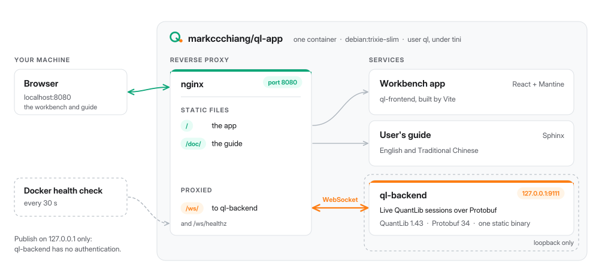

<p align="center">
  <picture>
    <source media="(prefers-color-scheme: dark)" srcset="assets/logo/logo-dark.svg">
    
  </picture>
</p>

# Interactive QuantLib Service — Docker image

A single Docker image that runs the whole
[Interactive QuantLib Service](https://github.com/markccchiang/ql-frontend): a
browser workbench for pricing options and interest-rate swaps, backed by
[QuantLib](https://www.quantlib.org/) running as a live, stateful service.

The image is built entirely from source:

| Component | Repository | What it becomes |
|---|---|---|
| ql-backend | [markccchiang/ql-backend](https://github.com/markccchiang/ql-backend) | the C++ WebSocket pricing daemon, linked statically against QuantLib and Protobuf |
| ql-frontend | [markccchiang/ql-frontend](https://github.com/markccchiang/ql-frontend) | the React app, plus the user's guide in English and Traditional Chinese |
| ql-protobuf | [markccchiang/ql-protobuf](https://github.com/markccchiang/ql-protobuf) | the wire schema, a submodule of both repositories above |
| QuantLib 1.43 | [lballabio/QuantLib](https://github.com/lballabio/QuantLib) | built with `QL_ENABLE_SESSIONS=ON` and OpenMP off, as ql-backend requires |
| Protobuf 34.0 | [protocolbuffers/protobuf](https://github.com/protocolbuffers/protobuf) | the release ql-backend is developed against |

Inside the container, nginx serves the app and the guide on port **8080** and
passes `/ws/` through to ql-backend. ql-backend listens only on loopback inside
the container.

<p align="center">
  <picture>
    <source media="(prefers-color-scheme: dark)" srcset="assets/architecture/architecture-dark.svg">
    
  </picture>
</p>

## Run it

```bash
docker run --rm -p 127.0.0.1:8080:8080 markccchiang/ql-app
```

Then open <http://localhost:8080>. The **Guide** button in the status bar opens
the user's guide.

Keep the `127.0.0.1:` prefix. ql-backend has no authentication, and publishing
the port on all interfaces would let anyone on your network use it.

The image is published for both `linux/amd64` and `linux/arm64`, so it runs
natively on Intel/AMD machines and on Apple Silicon.

### Another port or host name

ql-backend accepts a WebSocket only from the browser origins it has been told
about. The defaults cover `http://localhost:8080` and `http://127.0.0.1:8080`.
If you publish a different port or reach the container under another name, list
the origins in `QL_ALLOWED_ORIGINS` (space-separated):

```bash
docker run --rm -p 127.0.0.1:9000:8080 \
    -e QL_ALLOWED_ORIGINS="http://localhost:9000 http://127.0.0.1:9000" \
    markccchiang/ql-app
```

If you leave this out, the page loads but the status bar reports the service
as *running, but refusing this page*. `QL_ALLOWED_ORIGINS="*"` accepts any
origin. Use it only behind a proxy that checks origins itself.

### ql-backend options

Arguments after the image name are passed to ql-backend:

```bash
docker run --rm -p 127.0.0.1:8080:8080 markccchiang/ql-app --max-sessions 8 --session-grace 120
```

| Option | Meaning |
|---|---|
| `--max-sessions N` | the most live pricing sessions at once |
| `--max-connections N` | the most WebSocket connections at once |
| `--session-grace SECONDS` | how long a session outlives a dropped connection so the page can resume it (default 60, `0` turns it off) |

The entrypoint sets `--host`, `--port` and the origin flags itself.

### Health check and shutdown

The image has a `HEALTHCHECK` that queries `/ws/healthz` through nginx, so
`docker ps` shows the container as `healthy` once ql-backend is answering. You
can query it yourself:

```bash
curl http://localhost:8080/ws/healthz
```

`docker stop` (or Ctrl-C) drains ql-backend and exits cleanly. If either
process dies on its own, the other is stopped too and the container exits with
that process's status, so a restart policy such as `--restart unless-stopped`
sees one clear failure.

## Build it yourself

You need Docker with BuildKit (Docker 23 or later, or any Docker Desktop).
Nothing needs to be cloned first. The build clones ql-backend and ql-frontend
from GitHub along with their submodules, including ql-protobuf:

```bash
git clone https://github.com/markccchiang/ql-docker.git
cd ql-docker
docker build -t ql-app .
docker run --rm -p 127.0.0.1:8080:8080 ql-app
```

The first build compiles Protobuf and QuantLib from source. That takes 15–40
minutes depending on the machine, but the build cache keeps both, so later
builds only recompile what changed in ql-backend or ql-frontend.

### Build arguments

| Argument | Default | Purpose |
|---|---|---|
| `QL_BACKEND_REF` | `main` | branch or tag of ql-backend to build |
| `QL_FRONTEND_REF` | `main` | branch or tag of ql-frontend to build |
| `QL_BACKEND_REPO` / `QL_FRONTEND_REPO` | the GitHub URLs above | build from a fork |
| `BUILD_JOBS` | one per CPU | parallel compile jobs; lower it if the build runs out of memory |
| `VITE_WS_URL` | `/ws/` | where the app looks for the WebSocket; a relative path means the host that served the page |

For example, to build a release from tags:

```bash
docker build --build-arg QL_BACKEND_REF=v1.0.0 --build-arg QL_FRONTEND_REF=v1.0.0 -t ql-app:1.0.0 .
```

BuildKit resolves each ref on every build, so a new commit on `main` is picked
up without `--no-cache`.

**Out of memory?** A single QuantLib source file can take about 1 GB to
compile. If the build fails with `Killed` or `signal 9`, give Docker more memory
(Docker Desktop → Settings → Resources) or pass `--build-arg BUILD_JOBS=4`.

### Build from local checkouts

To build unpushed changes, point the build at local checkouts. Initialise their
submodules first with `git submodule update --init --recursive`:

```bash
docker build \
    --build-context ql-backend=/path/to/ql-backend \
    --build-context ql-frontend=/path/to/ql-frontend \
    -t ql-app:dev .
```

You can override either checkout and leave the other to be cloned. Each
repository's own `.dockerignore` keeps its build trees, `node_modules` and
`.git` out of the build.

### The schema check

ql-backend and ql-frontend each pin a commit of ql-protobuf as their `proto/`
submodule. They can only talk to each other if both pins name the same schema.
The `schema` stage compares the two, and if they differ the build stops with:

```
ql-backend and ql-frontend pin different ql-protobuf commits: build refs that agree
```

To fix it, move the submodule in one repository (`git -C proto checkout <commit>`,
then commit) or pick refs that agree.

## Publish to Docker Hub

Log in, then build both platforms and push them under one tag. Replace
`markccchiang` with your Docker Hub account if it differs:

```bash
docker login
docker buildx create --name ql-builder --use     # once; the default builder cannot push multi-platform images
docker buildx build \
    --platform linux/amd64,linux/arm64 \
    -t markccchiang/ql-app:1.0.0 \
    -t markccchiang/ql-app:latest \
    --push .
```

A machine can compile only its own architecture at native speed. The other
architecture runs under QEMU emulation, which makes the QuantLib build several
times slower (hours rather than minutes). To avoid that, build each platform
natively (for example on an x86 CI runner and an Apple Silicon Mac), push each
under its own tag, and merge the two into one tag:

```bash
# on an amd64 machine
docker buildx build --platform linux/amd64 -t markccchiang/ql-app:1.0.0-amd64 --push .
# on an arm64 machine
docker buildx build --platform linux/arm64 -t markccchiang/ql-app:1.0.0-arm64 --push .
# anywhere
docker buildx imagetools create -t markccchiang/ql-app:1.0.0 -t markccchiang/ql-app:latest \
    markccchiang/ql-app:1.0.0-amd64 markccchiang/ql-app:1.0.0-arm64
```

Labels on the image record which refs it was built from:

```bash
docker inspect markccchiang/ql-app --format '{{json .Config.Labels}}'
```

## What is in the image

| Path | Contents |
|---|---|
| `/usr/local/bin/ql-backend` | the pricing daemon (static QuantLib and Protobuf; stripped) |
| `/srv/ql-frontend` | the built app |
| `/srv/ql-frontend/doc/_build/html` | the user's guide (`zh-tw/` for Traditional Chinese) |
| `/etc/ql-frontend/nginx.conf` | nginx configuration, taken from ql-frontend's `docker/` |
| `/usr/local/bin/ql-entrypoint` | runs nginx and ql-backend together, taken from ql-frontend's `docker/` |

The base is `debian:trixie-slim`, and the processes run as the unprivileged
user `ql` under [tini](https://github.com/krallin/tini). The base images,
QuantLib and Protobuf are pinned by digest and commit, so they change only when
the Dockerfile changes. The two applications follow the refs you build.

## Licence

MIT, like ql-backend and ql-frontend. QuantLib is distributed under its own
[modified BSD licence](https://github.com/lballabio/QuantLib/blob/master/LICENSE.TXT),
and Protobuf under the BSD 3-Clause licence.
